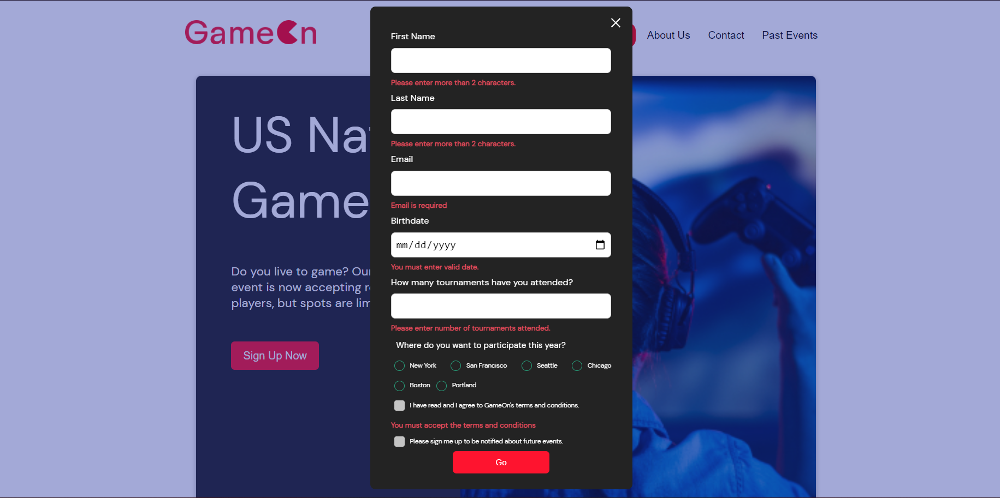
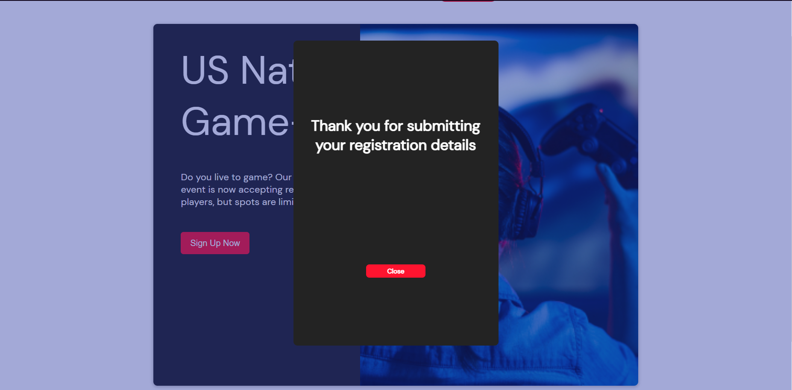
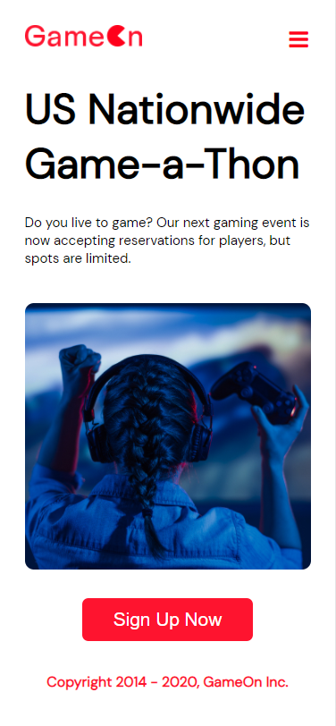

<h1 align="center">
</h1>

<h3 align="center">a mid-sized company specializing in gaming conferences and contests.</h3>

> ## **In a few words**
>
> The project is about building a landing page for GameOn to collect user information via form.

The form should validate user inputs via Javascript and display appropriate visual feedback to the user.

> ## **Developement technologies used**

- HTML and CSS
- Javascript

> ## **Key requirements for the project and a visual of the live results**

1. Add functionality to the close button of the form.

2. Add negative visual feedback to each input when input is incorrect upon submit.

3. Add a thank you message upon successfull form validation.

4. Fix all responsive issues left by the previous developper.

> ## **Learning goals of this project**

- Learn the basics of JavaScript programming.
- Learn to harvest the power of JavaScript for web developement.
